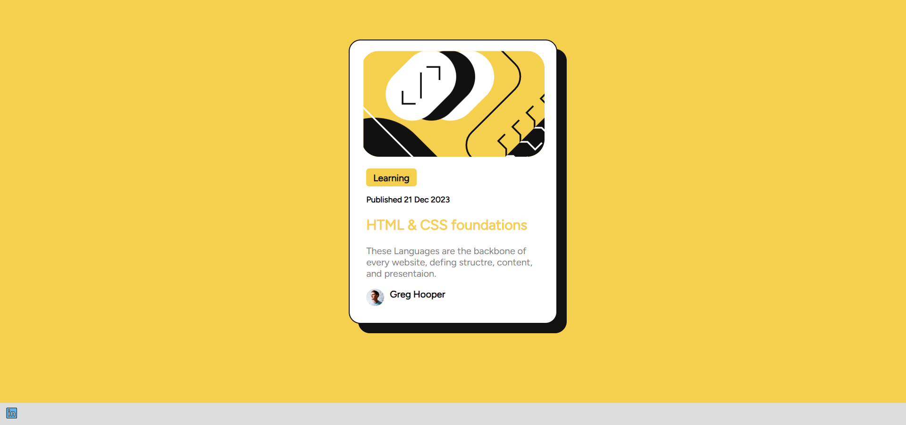
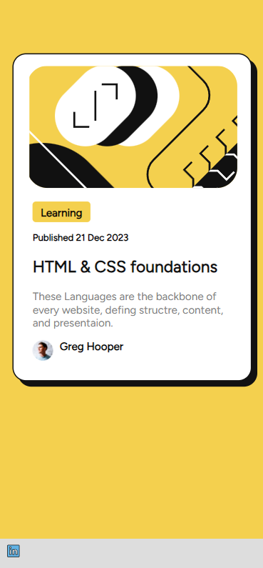
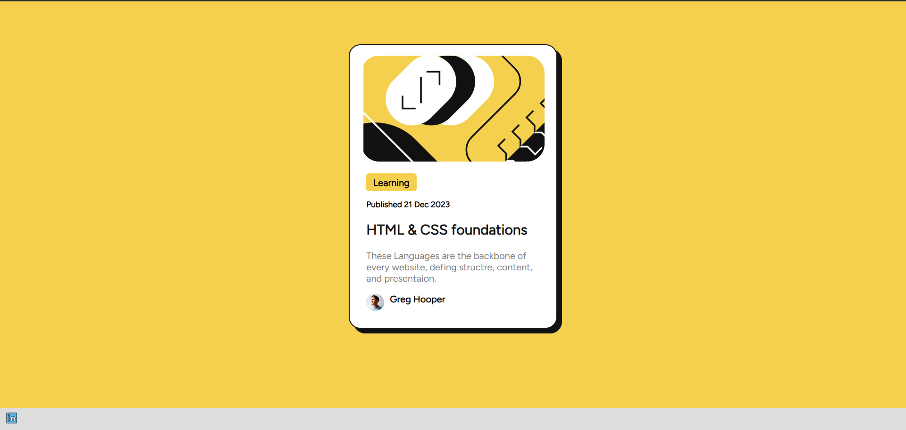

# This Challenge Taken From FrontEnd Elmentor - Blog Preview Card Solution

This Is A Solution To TThe [ Blog Preview Card Challenge On Frontend Mentor ].

## Table of contents

- [Overview](#overview)
  - [The challenge](#the-challenge)
  - [Screenshot](#screenshot)
  - [Links](#links)
- [My process](#my-process)
  - [Built with](#built-with)
- [Author](#author)

## Overview

### The challenge

Users should be able to:

- See hover and focus states for all interactive elements on the page
  1- text color of title for card change
  2- shadow behind the card increses

### Screenshot

### Links

- Solution URL: (https://github.com/ahmedehab161/blog-preview-card)
- Live Site URL: [This is the live site URL](https://ahmedehab161.github.io/blog-preview-card/)

## My process

### Built with

- Semantic HTML5 markup
- CSS custom properties
- CSS Grid
- Google Font

## Author

- Website - [Ahmed Ehab](https://ahmed-portfolio-6504f.web.app/)
- LinkedIn - [Ahmed Ehab](https://linkedin.com/in/ahmed-ehab-099118207)
- Github - [@ahmedehab161]
